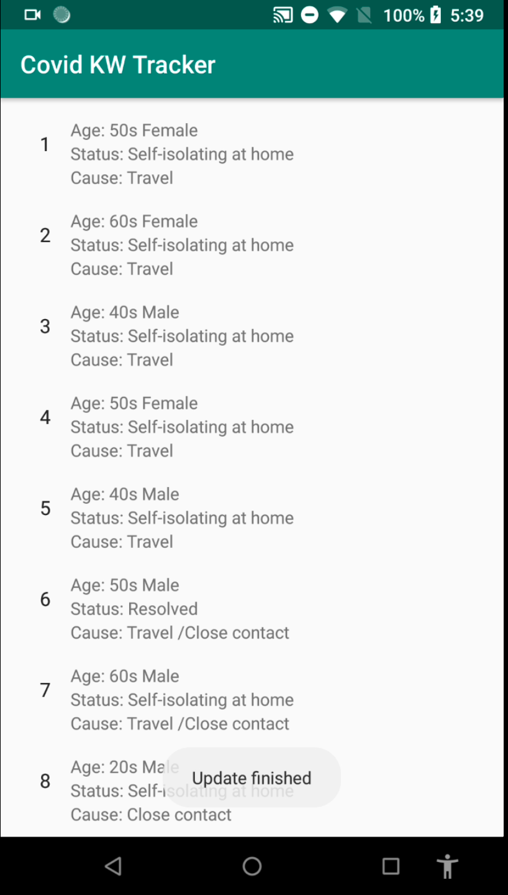

# Covid-19 Tracker
An Android App that displays Covid-19 info in the Kitchener-Waterloo region. Built for WinHacks2020

Check out our [Devpost](https://devpost.com/software/covid-19-tracker-6ajncq), and our [Demo Video](https://youtu.be/PEgTP5G2Yj8)!

---
## Inspiration
We felt the need to make data provided by the Waterloo reigon, more accessible on mobile devices. 

We'd like to thank the Region of Waterloo for making this data available on their website, during this global pandemic.

## What it does
Retriving a list of confirmed cases of Covid-19 from the Region's website, we display it in a mobile friendly format in an Android App.

## How We built it
We built a Flask API backend that uses `BeautifulSoup4` to scrape the [Region of Waterloo's webpage](https://www.regionofwaterloo.ca/en/health-and-wellness/positive-cases-in-waterloo-region.aspx). This Flask application runs on heroku, and exposes a REST API endpoint which returns JSON data of the Covid-19 cases in KW

Our Android app makes a request to the our above REST API, and displays it on screen to the user in a RecyclerView. Using Android's LiveData, ViewModel, and databinding, we display the data to the user in real time. 

## Accomplishments that We're proud of
This was our first time making an Android App, as well as using Flask.

## What we learned
We learnt a lot about how Android interacts with other services, and how to access a REST API JSON data feed.

## What's next for Covid 19 Tracker
We'd like to add another page, that displays a graph of the data to better visualize new cases. We're also aiming to implement a more user-friendly UI.

---
## References
- https://stackoverflow.com/questions/7606077/how-to-display-long-messages-in-logcat
### JSON
- https://stackoverflow.com/questions/33229869/get-json-data-from-url-using-android
- https://abhiandroid.com/programming/json